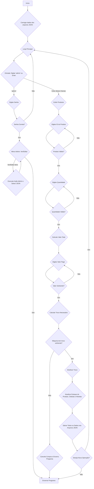

### Explicação Detalhada do Código

O programa simula uma máquina de venda de bebidas. Ele possui dois modos principais: um modo de compra para o cliente e um modo de administrador para gerenciar o estoque de produtos, cédulas e moedas.

#### 1. Importações
```python
# Importa a biblioteca json para leitura e escrita de arquivos JSON
import json
# Importa a função tabulate para exibir dados em formato de tabela no terminal
from tabulate import tabulate
```
- **`import json`**: Essencial para que o programa possa ler (`json.load`) e escrever (`json.dump`) dados em arquivos de texto no formato JSON. É assim que o estoque de produtos e dinheiro é salvo permanentemente entre as execuções do programa.
- **`from tabulate import tabulate`**: Importa uma função específica de uma biblioteca externa que serve para formatar listas de dados em tabelas bonitas e organizadas no terminal, melhorando a experiência do usuário.

#### 2. Função Auxiliar: `formatar(valor)`
```python
def formatar(valor):
    try:
        # Converte o valor para float, pois a formatação f-string requer um número.
        valor_numerico = float(valor)
    except (ValueError, TypeError):
        # Caso a conversão falhe, retorna um valor padrão.
        return "R$ --,--"

    # Formata o número com duas casas decimais e usa '_' como separador de milhar.
    texto_formatado = f"R${valor_numerico:_.2f}"
    
    # Substitui os caracteres para o padrão brasileiro.
    texto_formatado = texto_formatado.replace('.', ',').replace('_', '.')
    
    return texto_formatado
```
- Esta função recebe um valor (que pode ser um número ou uma string, como "5.50" vindo do JSON) e o formata como moeda brasileira (ex: `R$ 1.234,50`).
- **`try...except`**: Garante que se a função receber algo que não possa ser convertido para número, o programa não quebre.
- **`float(valor)`**: Converte a entrada para um número de ponto flutuante, passo crucial para a formatação.
- **`f"R${valor_numerico:_.2f}"`**: Uma f-string de formatação. `:_.2f` significa:
    - `.2f`: Formate como um número de ponto flutuante com 2 casas decimais.
    - `_`: Use o underscore `_` como separador de milhar.
- **`.replace('.', ',').replace('_', '.')`**: Realiza duas substituições para adequar ao padrão brasileiro: troca o ponto decimal por vírgula e o separador de milhar `_` por ponto.

#### 3. Funções de Manipulação de JSON
```python
def carregar_json(arquivo):
    # ...
def salvar_json(arquivo, dados):
    # ...
```
- **`carregar_json(arquivo)`**: Abre um arquivo JSON em modo de leitura (`"r"`) e retorna os dados como uma estrutura de dados Python (uma lista de dicionários, neste caso). Inclui tratamento de erros para caso o arquivo não exista (`FileNotFoundError`) ou esteja mal formatado (`json.JSONDecodeError`).
- **`salvar_json(arquivo, dados)`**: Abre um arquivo em modo de escrita (`"w"`) e salva os dados Python (a lista de dicionários) de volta no formato JSON.
    - **`indent=4`**: Formata o arquivo JSON de forma legível para humanos, com 4 espaços de indentação.
    - **`ensure_ascii=False`**: Permite que caracteres especiais como "ç" e "á" sejam salvos corretamente sem serem convertidos para códigos de escape.

#### 4. Funções de Exibição (Tabelas)
```python
def mostrar_produtos(produtos):
    # ...
def mostrar_lista(lista, tipo):
    # ...
```
- **`mostrar_produtos(produtos)`**: Recebe a lista de produtos e usa `tabulate` para exibi-los em uma tabela com os cabeçalhos "ID", "Bebida", "Preço" e "Estoque". O preço é formatado usando a função `formatar`.
- **`mostrar_lista(lista, tipo)`**: Uma função mais genérica, usada tanto para cédulas quanto para moedas. Ela exibe uma tabela com "ID", "Item" (o valor formatado da cédula/moeda) e "Estoque".

#### 5. Funções do Fluxo de Compra
```python
def escolher_produto(produtos):
    # ...
def solicitar_quantidade(produto):
    # ...
def calcular_pagamento(preco, qtd):
    # ...
```
- **`escolher_produto(produtos)`**: Pede ao usuário para digitar o ID do produto e fica em um loop até que um ID válido seja inserido. Retorna o dicionário do produto escolhido.
- **`solicitar_quantidade(produto)`**: Pede a quantidade desejada, validando se o valor é um número inteiro e se está dentro do estoque disponível.
- **`calcular_pagamento(preco, qtd)`**: Uma função simples que multiplica o preço (convertido para `float`) pela quantidade e retorna o total.

#### 6. Funções de Pagamento e Troco
```python
def pagamento(valor, cedulas, moedas):
    # ...
def distribuir_troco(troco, cedulas, moedas):
    # ...
```
- **`pagamento(...)`**: Orquestra o processo de pagamento.
    1. Mostra o total a pagar.
    2. Pede ao usuário o valor pago e valida se é suficiente.
    3. Calcula o troco.
    4. **Verificação Crítica**: Calcula o total de dinheiro disponível na máquina. Se o troco necessário for maior que esse total, a compra é cancelada, o dinheiro do cliente é "devolvido" e o programa encerra com `exit()`.
    5. Se houver troco, chama `distribuir_troco` para calcular quais cédulas e moedas devem ser dadas.
    6. Exibe o troco distribuído em uma tabela.
- **`distribuir_troco(...)`**: É o "cérebro" do cálculo de troco.
    1. Junta cédulas e moedas em uma única lista e a ordena do maior valor para o menor.
    2. Percorre essa lista ordenada (ex: R$100, R$50, ..., R$0.05).
    3. Para cada valor, calcula quantas notas/moedas podem ser usadas para compor o troco restante, diminuindo o estoque a cada unidade usada.
    4. Retorna as listas de cédulas e moedas com estoques atualizados e uma lista do troco que foi efetivamente distribuído.

#### 7. Modo Administrador
```python
def modo_admin(produtos, cedulas, moedas, caminho):
    # ...
def editar_produtos(produtos, caminho):
    # ...
def criar_novo_produto(): # e outras funções de edição
    # ...
def remover_produto(produtos, caminho):
    # ...
def editar_estoque(lista, tipo, caminho):
    # ...
```
- **`modo_admin(...)`**: Ponto de entrada do modo de gerenciamento. Primeiro, pede uma senha (hardcoded como "usuario"). Se correta, exibe um menu com opções.
- **`editar_produtos(...)`**: Apresenta um submenu para criar, editar ou remover produtos.
- **Funções de Edição (`criar_novo_produto`, `editar_produto_existente`, etc.)**: Contêm a lógica específica para cada ação, como pedir os novos dados ao administrador e atualizar a lista de produtos.
- **`remover_produto(...)`**: Permite remover um item, mas com uma regra de segurança: só permite a remoção se o estoque do produto for zero.
- **`editar_estoque(...)`**: Função usada para alterar o estoque de cédulas e moedas, reutilizando a `mostrar_lista` para exibir os itens disponíveis para edição.

#### 8. Execução Principal (Bloco `while True`)
```python
# Define o caminho base para os arquivos JSON
caminho = "./Projetos Colaborativos/Máquina de bebidas/"

# Carrega os dados dos arquivos
produtos = carregar_json(caminho + "produtos.json")
# ...

print("=== MÁQUINA DE BEBIDAS ===")

# Loop principal da aplicação
while True:
    # ... (lógica principal)
```
- **Inicialização**: Define o caminho para os arquivos JSON e carrega os dados de produtos, cédulas e moedas na memória.
- **Loop Principal `while True`**: O coração do programa, que o mantém rodando.
    1. **Seleção de Modo**: Pergunta se o usuário quer entrar no modo `admin` ou continuar como cliente.
    2. **Modo Admin**: Se "admin", chama `modo_admin`. Se essa função retornar `True` (usuário escolheu sair), o loop principal é quebrado com `break`.
    3. **Modo Cliente**:
        - Exibe os produtos (`mostrar_produtos`).
        - Guia o usuário pela escolha, quantidade e pagamento.
        - Se o pagamento for bem-sucedido (o programa não for encerrado pela falta de troco), o estoque do produto é atualizado.
        - Os dados atualizados (produtos, cédulas, moedas) são salvos nos arquivos JSON.
    4. **Nova Operação?**: Pergunta ao usuário se deseja fazer outra compra. Se a resposta não for "s", o loop é quebrado.
- **Finalização**: Uma mensagem de agradecimento é exibida quando o loop termina.

---

### Fluxograma do Funcionamento do Programa

Este fluxograma representa a lógica de alto nível do programa, mostrando as principais decisões e processos.



**Legenda do Fluxograma:**
- **Caixas Retangulares**: Processos (ex: "Carregar dados").
- **Losangos (Diamantes)**: Decisões (ex: "Senha Correta?").
- **Setas**: Indicam o fluxo do programa.
- **Caixa com cantos arredondados (Terminator)**: Início ou Fim do programa.