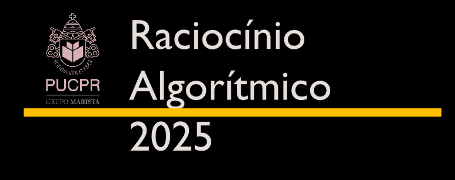

# Raciocínio Algorítmico – PUCPR

### Repositório da Disciplina

Este repositório reúne os materiais desenvolvidos durante a disciplina **Raciocínio Algorítmico**, cursada no **1º Período do Bacharelado em Ciência da Computação da Pontifícia Universidade Católica do Paraná (PUCPR)**.

A disciplina é focada em **programação com a linguagem Python**, e tem como objetivo o desenvolvimento do pensamento computacional por meio da construção de algoritmos para resolução de problemas.

---

## Conteúdo do Repositório

- 📁 Pastas organizadas por **Aulas**, **Listas de Exercícios**, **Projetos Colaborativos** e **Desafios**
- 💡 Exercícios resolvidos e comentados
- 🧠 Implementações de algoritmos com foco em lógica e estruturas básicas

---

## Sobre a Disciplina

A disciplina **Raciocínio Algorítmico** trata do desenvolvimento do pensamento computacional por meio da construção de algoritmos. Durante o semestre, os estudantes aprendem a:

- Manipular **variáveis**
- Utilizar **expressões lógico-aritmético-relacionais**
- Aplicar **estruturas de controle de fluxo**
- Trabalhar com **estruturas de dados homogêneas** (como listas)
- Criar e utilizar **funções** para modularizar soluções

Ao final da disciplina, o aluno é capaz de **implementar programas de baixa complexidade** com **autonomia** e **colaboração**, utilizando a linguagem de programação **Python**.

---

## Linguagem Utilizada

- 🐍 **Python**

---

## Autor

Desenvolvido por **Sérgio Calazans**, estudante do curso de Ciência da Computação – PUCPR.
